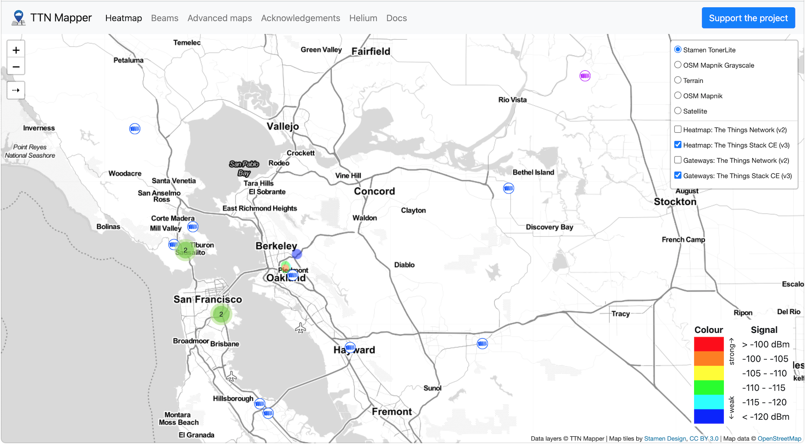
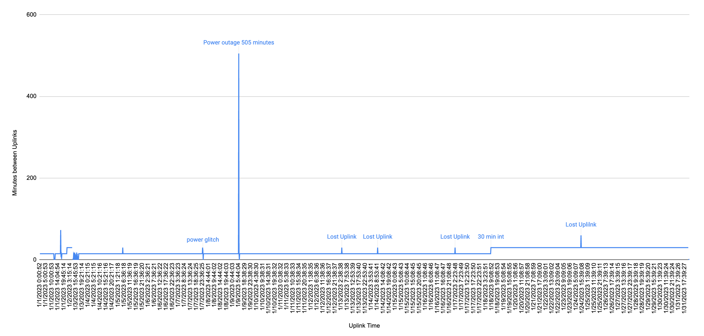

# TL;DR

Forked from https://github.com/lnlp/LMIC-node, this repository supports a production IoT sensor providing 

	- instantaneous power measurements using a CT Clamp
	- temperature 
	- humidity
	
The device, Heltec WiFi LoRa 32 V2, is communicating via LoraWAN on the Helium Network (HNT) in the SF Bay Area, USA.  The sensor was also working on HNT and The Things Networks in Munich, Germany.  The impetus for this project was to confirm that several pumps were working at a site 9 time zones away with no access to WLAN and unreliable personnel.  Energy usage was not the goal, but the project could be expanded to include this in the future (a bit tricky due to low frequency of uplinks on LoRaWAN).  

*Heltec Lora 32 monitoring HVAC blower motor*

## Background

The primary goal of this project is to monitor a remote pump to insure it is functioning.  Access to AC power electrical wiring is possible, which led to the exploration of a using a CT Clamp to monitor instantaneous power.  
	
After exploring the possible communication alternatives for monitoring a remote sensor, LoRaWAN was decided on for testing.   WLAN was not accessible and GPRS/GSM/LTE/4G/5G would be expensive.  Other methods probably exist, but were not explored.   

## Sensor hardware

Familiarity with the ESP8266 - NodeMCU led me to look for an ESP type sensor.  In fact the project started with the ESP8266 and later migrated to LoRaWAN on the Heltec device.  The Heltec WiFi LoRa 32 V2 is ESP32 based.   The integrated LoRaWAN hardware turned out to be an excellent choice to reduce development time, since the LoRaWAN radio and ESP are built into the development board (no wiring required).  Onboard display is also nice for troubleshooting.

## LoRaWAN software

Software that easily supported existing LoRaWAN services was a bit tricky.  I first explored Heltec's proprietary code (requires a license key).  Point to point examples exist, but the sensor needs to communicate with a service provider.  The Things Network forum which led me to the base code for the project LMIC-node.
	
https://www.thethingsnetwork.org/forum/t/example-tutorial-of-connecting-a-heltec-v2-to-ttn/58930
	
Later I found this excellent repository, forked from the LMIC-node code:  
	
https://github.com/Chiumanfu/LMIC-node_Sensor-for-Helium-Network
	
Full of tips and tricks for deploying on the Helium Network.  Especially useful is the example byte order for DEVEUI and APPEUI within HNT, as well as, the TagoIO integration examples.

## Open Energy Monitor and CT Clamp 

Nice write up on how to monitor energy usage.   This became the starting point for this project.
		
https://savjee.be/blog/Home-Energy-Monitor-ESP32-CT-Sensor-Emonlib/
	
### Calibration 

Calibration of the CT clamp is required.  Good background information here:
	
https://community.openenergymonitor.org/t/calibration-and-parameters-in-emonlib/6855
			
Trial and error seemed to be the fastest way to calibrate using a volt meter with CT clamp and the sensor side by side.

*CT clamp calibration*

## LoRaWAN Service Provider

The final location of this device is the SF Bay Area.  The Things Network (TTN) has very little coverage there.  Although TTN was tested in Munich, it was quickly abandoned in favor of HNT, which is supported widely in the Bay Area.
	

*TTN Coverage Map*
	
	

*HNT Coverage Map*

	
## Sensor Data
	
Many ways to display the uplink data.  The HNT website has good information for various 3rd party integrations. Both Google Sheets and TagoIO integrations were implemented for this project.  TagoIO gives quick access to raw payload, hotspot name, RSSI, SNR and SF.  Tagoio.js in the payload-formatters directory works for this device.
	
### Google sheets
	
Most flexible way to show data.  HNT has a good tutorial here : [Google Sheets Tutorial](https://docs.helium.com/use-the-network/console/integrations/google-sheets/).  Live sensor data here showing pump iRMS:  [Pump iRMS](https://docs.google.com/spreadsheets/d/e/2PACX-1vQj1dn7G-eRcmEB5HmqzgXQ_rtUPW68QRESnKMKsQ1TotCIrERJMUct81eylsNTOlBHo3MNF0EYcU-y/pubchart?oid=1019867124&amp;format=interactive).
	
I was also curious how many LoRaWAN uplinks were dropped, so I'm tracking time between uplinks here: [Uplink Intervals](https://docs.google.com/spreadsheets/d/e/2PACX-1vQj1dn7G-eRcmEB5HmqzgXQ_rtUPW68QRESnKMKsQ1TotCIrERJMUct81eylsNTOlBHo3MNF0EYcU-y/pubhtml?gid=776933052&amp;single=true&amp;widget=true&amp;headers=false).   In January 2023 this chart shows two power outages (one lasting 505 minutes) and 4 lost uplinks at 15 minute intervals.  On January 18th I sent a downlink command and changed to uplink interval to 30 minutes and 1 uplink was lost for the remainder of January.

	

*Lost uplinks*

	
## Troubleshooting and notes
	
	
